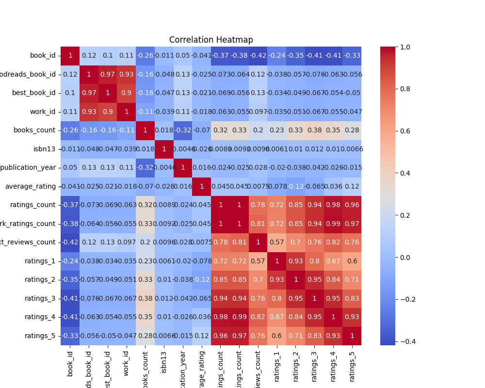

# Dataset Analysis Report

### Title: The Tale of the Book Analytics Adventure

Once upon a time in the digital realm of data, a group of inquisitive analysts embarked on a journey through a vast dataset, which held the stories of 10,000 books cherished by readers all around the world. With numbers as their companions, they traversed the landscape of information, eager to unveil the secrets hidden in their library of knowledge.

#### The Characters in the Dataset

In this rich narrative, our primary characters were the metrics representing various facets of each book:

1. **Book IDs**: These unique identifiers ranged from 1 to 10,000, with an average of 5,000.5, highlighting the diversity in the collection.

2. **Goodreads and Best Book IDs**: They pointed to the book's presence on platforms that readers trust, with mean values of 5,264,696.51 and 5,471,213.58, respectively. 

3. **Publication Insights**: The original publication years inched across time, from an ancient past (1750) to a contemporary edge (2017), with a central theme in the early 1980s. 

4. **Ratings and Reviews**: The average rating hovered around 4.00, illustrating a generally favorable perception by the reading community. The counts of ratings and reviews provided insight into each book's popularity, with maximum ratings soaring into the hundreds of thousands.

#### Key Findings from the Epic Journey

As the analysts examined the dataset closely, several notable findings emerged:

- **Popularity Metrics**: The average rating of around 4.00, coupled with a significant ratings count mean of 54,001.24, revealed that many books enjoyed substantial readership and positive feedback. The spread of ratings (1 to 5) illustrated engagement levels, with ratings of 4 and 5 drawing attention, showing that books are not only read but loved.

- **Publication Trends**: A notable median original publication year of 2004 suggested that the dataset was rich with contemporary literature while still housing older classics.

- **ISBN Data Challenges**: The presence of missing values—particularly in the ISBN and ISBN13 fields—indicated some inconsistency in data collection. This could hinder linking books across different systems or databases, signaling an area ripe for improvement.

#### The Analysts' Recommendations

The analysts pondered over their discoveries and formulated several recommendations for potential use cases and next steps:

1. **Enhanced Data Collection**: Improve methods for capturing missing ISBN data and original titles. Establish checks to ensure complete records to bolster the dataset's integrity.

2. **Reader Preference Insights**: Conduct further analysis on trends across publication years versus average ratings to identify whether contemporary books are favorably rated compared to their classic counterparts. This could inform publishers and authors about shifting reader preferences.

3. **Targeted Marketing Strategies**: Utilize insights on books with higher ratings and review counts to develop targeted marketing strategies for authors, helping them ensure that their marketing efforts reach audiences that appreciate their genre or style.

4. **Personalized Recommendation Systems**: Employ this dataset to enhance machine learning algorithms designed for personalized book recommendations. Analyzing ratings and review counts in conjunction with user profiles could lead to more tailored suggestions.

5. **Visualizing Data Trends**: Create visual dashboards that track changes in average ratings over time or publication year trends, making it easier for stakeholders to digest the insights at a glance.

6. **Community Engagement**: Foster a community around the books with high ratings and text reviews, perhaps creating forums or book clubs to discuss popular selections and encourage further exploration among readers.

### Conclusion: A Journey of Discovery

In the end, the analysts returned from their expedition invigorated by the colors and stories woven into their dataset. With their insights and recommendations in hand, they sought to inspire other storytellers—be it authors, publishers, or digital platforms—to connect more deeply with readers, unlocking new chapters in the ever-evolving narrative of the literary world. The journey was just beginning, and the potential to shape the future of books awaited them.

