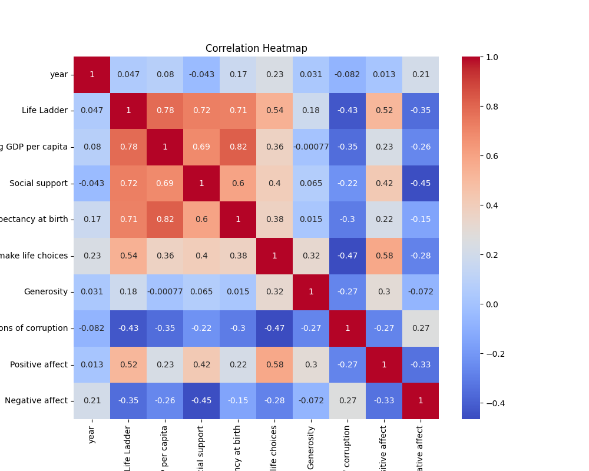

# Dataset Analysis Report

Once upon a time in the realm of data analytics, a researcher delved into a rich dataset that tracked various metrics influencing the well-being and happiness of people across different nations from 2005 to 2023. Their mission was to uncover trends, relationships, and insights that could inform future policies aimed at improving life conditions globally. 

### The Dataset
The dataset contained 2,363 observations and focused on crucial aspects such as the 'Life Ladder,' 'Log GDP per capita,' 'Social Support,' 'Healthy Life Expectancy,' and several psychological metrics, including 'Positive Affect' and 'Negative Affect.' These variables served as the pillars of happiness and satisfaction within different countries, allowing the researcher to draw meaningful conclusions about societal well-being.

### The Analysis
The research findings were summarized through a series of statistical measures, painting a detailed picture of the current landscape. 

1. **Life Ladder**: The average score was around **5.48**, suggesting that individuals in the dataset generally perceive their lives positively. However, with a standard deviation of **1.12**, it indicates considerable variations among countries, with minimum and maximum scores ranging from **1.281** to **8.019**.

2. **Log GDP per capita**: GDP is a significant economic indicator, and the average value stood at approximately **9.40**. This correlates strongly with happiness indicators, suggesting that wealthier nations tend to experience higher life satisfaction levels.

3. **Social Support**: With a mean of **0.81**, it signifies that individuals feel supported by family and friends—a critical factor influencing happiness. 

4. **Healthy Life Expectancy**: An average of **63.4 years** indicates varying health conditions across countries, as some enjoy long, healthy lives, while others struggle with premature mortality.

5. **Freedom to Make Life Choices**: A mean score of **0.75** reflects the ability of individuals to exercise autonomy in life decisions, a significant contributor to personal satisfaction.

6. **Generosity**: Surprisingly, Generosity displayed a mean value close to zero, hinting at varied attitudes towards charitable actions across different regions.

7. **Perception of Corruption**: An average score of **0.74** suggests moderately negative perceptions of corruption, highlighting an area for growth for many nations.

8. **Affect Measures**: The balance of Positive Affect (**0.65**) and Negative Affect (**0.27**) indicates a generally optimistic outlook among respondents, though there is still room for improvement.

### Missing Values
Interestingly, the analysis also revealed missing values in several metrics, including **Log GDP per capita** and **Generosity**. This gap indicates areas for potential investigation, as missing data might reveal biases or shifts in the underlying trends.

### Key Findings
The analysis conjured a narrative revealing strong interrelationships among various well-being indicators. Countries that ranked high in GDP tended to enjoy higher life satisfaction. Social support emerged as a linchpin in fostering happiness, and while the effects of economic prosperity were visible, psychological factors like perceptions of corruption and individual freedom played critical roles as well.

### Potential Use Cases and Next Steps
1. **Policy Formulation**: Governments can use these insights to inform policies targeting economic growth, healthcare, and social welfare programs that enhance overall quality of life.

2. **Further Research**: Investigating the reasons behind missing values in certain metrics could uncover biases or data collection issues, allowing for more robust future analyses.

3. **Web Applications**: Developing interactive dashboards for policymakers and stakeholders to explore these findings would enhance data-driven decision-making.

4. **International Comparisons**: Encouraging a global dialogue based on these findings between countries with similar issues could foster collaboration and exchange of effective strategies for improving citizen well-being.

In conclusion, the dataset served not just as a collection of numbers but as a rich tapestry of human experiences and societal conditions, each element telling a story of its own. By illuminating these insights, we can honor the journey of people worldwide towards better lives and greater well-being while paving the path towards solutions that truly resonate with the human spirit.

