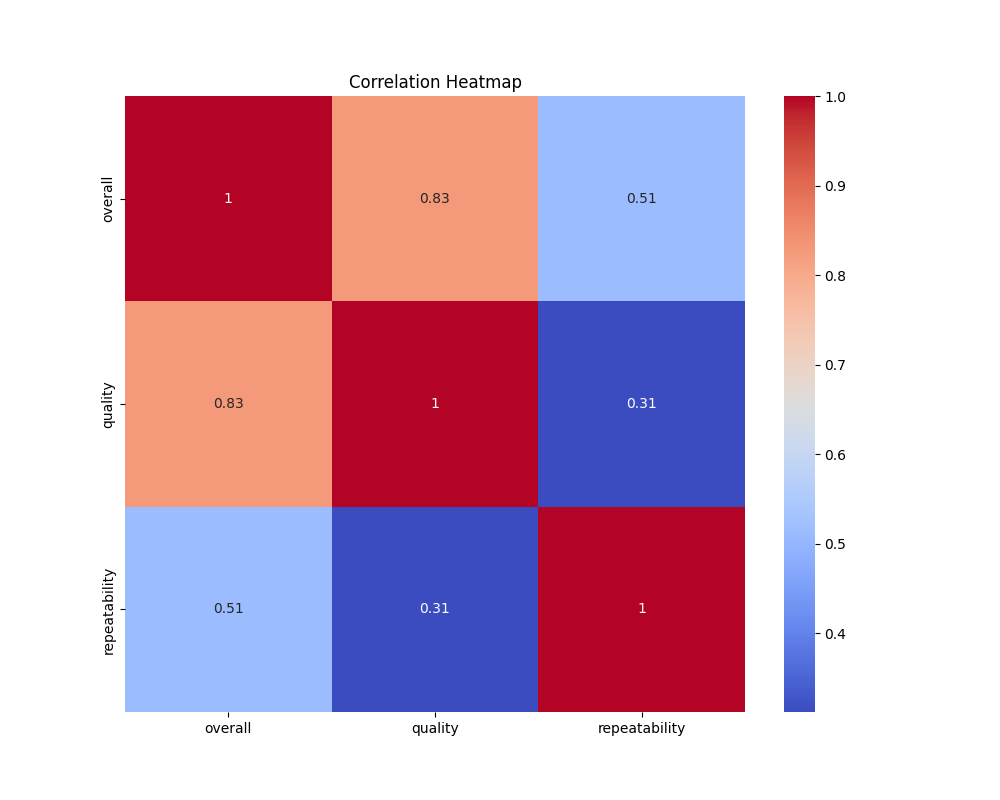

# Dataset Analysis Report

Once upon a time, in a bustling digital library, a team of researchers explored a rich dataset containing user ratings and feedback on a collection of various titles. They aimed to analyze user perceptions, uncover trends, and, ultimately, enhance the library's offerings. With a dataset of 2,652 entries, the researchers embarked on their analytical journey, eager to reveal the stories hidden within the numbers.

### The Foundations of Analysis

The dataset provided a comprehensive snapshot of user feedback on several dimensions: overall rating, quality, and repeatability. Each user rated their experiences on a scale from 1 to 5, which allowed the researchers to extract meaningful statistics from this treasure trove of information. 

1. **Overall Ratings**: The average overall rating was about 3.05, with a standard deviation of 0.76, indicating a moderate level of satisfaction among users. Notably, while some users rated their experiences as low as 1, the highest ratings reached a promising 5, suggesting a mix of strong opinions.

2. **Quality Ratings**: This dimension revealed an average quality score of 3.21, slightly higher than the overall score, which indicated that users perceived the content itself to be of slightly better quality than their overall rating would suggest. Here too, the ratings varied, with a minimum of 1 and a maximum of 5.

3. **Repeatability**: But the tale doesn’t end here. The repeatability score averaged at 1.49, with most ratings clustered tightly around 1, suggesting that users were not inclined to revisit titles they previously encountered. With a spread of only up to 3, this could indicate dissatisfaction or simply a lack of appeal for revisiting certain experiences.

### Missing Values: A Puzzle

As the researchers dove deeper, they encountered some missing values. The 'by' column, which presumably represents authors or contributors, had 262 entries missing, while the 'date' field had 99 missing values. This gap in information raised red flags and invited the researchers to ponder the potential consequences. Would this missing information skew their understanding of user experiences? How crucial were these fields in interpreting the feedback?

### Key Findings and Insights

From their exploratory analysis, the researchers identified several critical insights:
- The overall ratings were somewhat polarized, revealing a disparity in user experiences. It suggested that while many users enjoyed what they engaged with, there remained a notable faction that did not have as pleasing an experience.
- Despite an above-average quality score, poor repeatability hinted at a disconnect. Were users finding the initial experiences satisfying only to be disappointed upon revisiting? Or did the content lack the depth to warrant repeated engagement?
- The frequent missing values in the 'by' field called for a further investigation into how influential the authors or contributors were in shaping user opinions. 

### Suggestions for Next Steps

With their analysis complete, the researchers gathered around to discuss potential next steps:

1. **Data Cleaning**: Addressing the missing values should be a priority. This might involve seeking out the missing entries or even considering imputation strategies to fill gaps in the dataset for a more comprehensive analysis.

2. **Depth of Content**: Investigate the specific aspects of quality that users found appealing or lacking. Conducting follow-up surveys or interviews could provide qualitative insights into user expectations and experiences.

3. **Engagement Strategies**: Explore ways to enhance repeatability by possibly revisiting and refreshing the content library or introducing follow-up recommendations based on user interests. 

4. **Segmentation**: Exploring the dataset by user demographics (if available) could unearth patterns that aid in targeted marketing or user engagement strategies. 

5. **Tracking Improvements**: Implementing a feedback loop to consistently gather data over time and analyze the impact of any changes made will be crucial for ongoing improvements.

Thus, from humble beginnings with numbers and ratings, the researchers uncovered narratives of user experience. Their journey through the data offered insights, suggesting routes for significant improvements in service delivery and user satisfaction, ensuring that the library would not just remain a provider of information but evolve into a nurturing community for book lovers. 

And thus, the journey of inquiry continues, with each new rating offering a deeper understanding of the epic tale that is user engagement.

